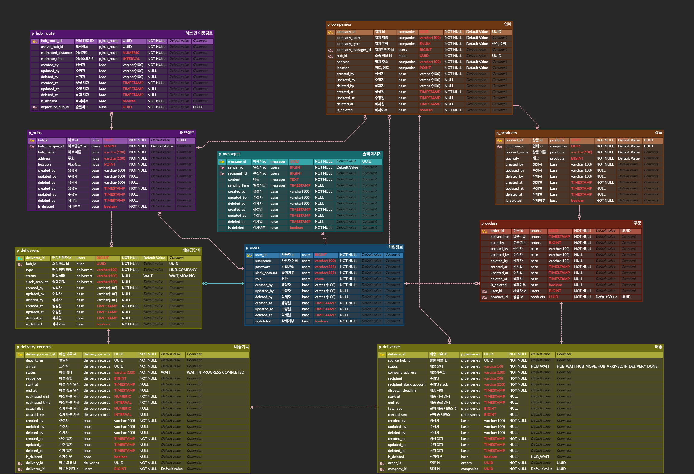

 
  <h1>🚚 물류 배송 시스템 (Logistics Delivery System)</h1>

  <h3>YukCanDoIt 6조</h3> 

 

## 프로젝트 진행 기간
2024.12.05 - 2024.12.17

## 프로젝트 개요

마이크로서비스 아키텍처 (MSA) 기반으로 설계된 물류 배송 관리 시스템

주문, 사용자 관리, 배송 추적, 알림 등을 각각의 독립된 서비스로 분리해 유연성과 확장성을 도모

## 🧑🏻‍💻 팀 구성

<table style="width: 100%; text-align: center;">
<tbody>
<tr>
<td style="text-align: center;">
<a href="https://github.com/ewoo14">

 
<b>박은우</b>
 
</a>
user, gateway
</td>
<td style="text-align: center;">
<a href="https://github.com/sooooooongyi">

 
<b>박송이</b>
 
</a>
core
</td>
<td style="text-align: center;">
<a href="https://github.com/le-monaaa">

 
<b>이유빈</b>
</a>
 
delivery
</td>
<td style="text-align: center;">
<a href="https://github.com/HanBeom98">

 
<b>조한범</b>
 
</a>
order
</td>
</tr>
</tbody>
</table>

## 인프라 구성
- Eureka Server: 마이크로서비스 등록 및 디스커버리 서버
- API Gateway: 외부 요청에 대한 JWT 인증과 라우팅 처리
- User Service: 사용자 관리
- Core Service: 주문, 업체, 상품 관리
- Delivery Service: 배송 추적 및 관리
- Slack Service: Slack 알림 전송
- Database: PostgreSQL을 통한 데이터 관리 (서비스마다 분산)
- Zipkin: 분산 추적을 통해 서비스 간 호출 흐름을 시각화

## API Docs
[API 명세서](https://www.notion.so/teamsparta/c64204c1b9804be39687492c54d661b6?v=1532dc3ef5148189975c000c175cb7b0&p=1b76e1b74b0149a4a52ef816bf0fa4db&pm=s)

## 개발 환경

  
   
  
 

## ERD

## 실행 방법
1. Docker Desktop 설치
2. logisix 최상위 루트에서 `docker-compose up -d` 입력
3. 컨테이너 생성 후 `http://gateway:19091/api/v1/core/` 경로로 API 호출
